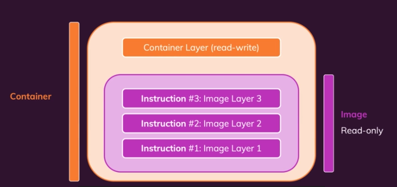

## Understanding image layers

### 1. Dockerfile과 이미지 빌드

* `Dockerfile`을 사용하여 이미지를 빌드할 때 변경된 내용이 없다면 이전에 만든 이미지 레이어(layer)를 사용한다.
* 이미지 레이어는 `Dockerfile`에 정의된 명령(instruction)마다 생성된다.
* 캐싱(caching) 된 이미지 레이어를 사용하면 빌드 속도가 향상된다.
* 변경된 내용이 있는 명령부터 하위 명령들은 모두 다시 실행한다.

### 2. 이미지와 컨테이너

* 이미지를 기반으로 컨테이너를 실행하면 새로운 컨테이너 레이어가 생성된다.
* 컨테이너 레이어는 읽기(read), 쓰기(write)가 모두 가능하다.
* 컨테이너가 실행되어 발생되는 변경 사항들은 모두 컨테이너 레이어에서 사용된다.

### 3. Dockerfile 작성 방법

* `npm install` 같은 시간이 많이 소요되는 명령은 먼저 실행한다.
* 의존 관계가 없다면 시간이 많이 소요되는 명령 다음에 자주 변경되는 자원을 다루는 명령을 실행한다.