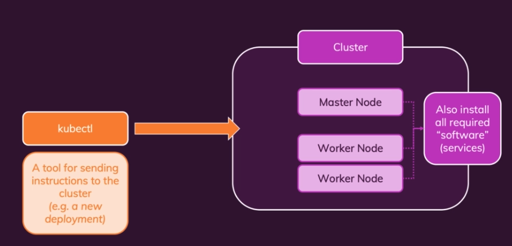

## Kubernetes: Required Setup and Intallation Steps

## 1. Required Setup

* Cluster 구성
    * Master Node
    * Worker Nodes
* kubectl 설치
    * 클러스터에 명령어를 보낼 수 있는 도구

## 2. Installation

* kubectl is tool to command instruction to kubernetes cluster
    * <https://kubernetes.io/docs/tasks/tools/#install-with-homebrew-on-macos>
* minikube
    * minikube is local Kubernetes, focusing on making it easy to learn and develop for Kubernetes.
    * <https://minikube.sigs.k8s.io/docs/start/>