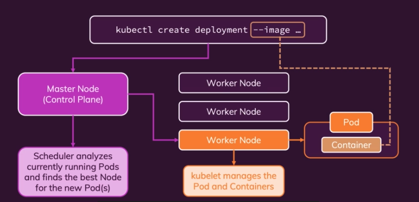

## kubectl: Behind the scenes

### 1. kubectl create deployment --image 호출 시 동작 과정

* Master Node(Control Plane)에 명령어를 전달한다.
* Master Node는 Cluster에 필요한 모든 것들을 만든다.
    * distribuing the Pods across worker nodes
    * Scheduler analyzes currently running Pods
    * Finds the best Node for the new Pods
    * Pod를 우리의 Worker Nodes 중 하나에게 생성한다.
* Worker Node의 kubelet은 Pod와 Container를 관리한다.
    * Stard Pod and Container
    * Managing Pod and Container 
* Pod는 `--image` 옵션에서 지정한 이미지를 기반으로 컨테이너를 실행한다. 

