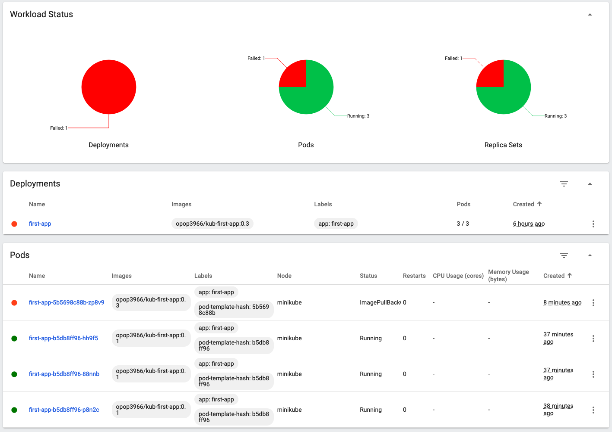

## Updating Deplyoments

### 1. deployments 객체의 이미지 업데이트 실패 시

* 존재하지 않는 이미지로 업데이트를 시도합니다.
* 새로운 이미지로 pod 생성이 실패하고 3개의 Pods는 유지됩니다.

```
$ kubectl set image deployment/first-app kub-first-app=opop3966/kub-first-app:0.3

$ kubectl rollout status deployment/first-app
Waiting for deployment "first-app" rollout to finish: 1 out of 3 new replicas have been updated...
```

##### minikube dashboard



### 2. rollback

* 배포에 실패했으면 롤백해야 된다.

```
$ kubectl rollout undo deployment/first-app
deployment.apps/first-app rolled back
```

* `--to-revision` 옵션을 사용하면 특정 시점으로 롤백할 수 있다. 

```
$ kubectl rollout undo deployment/first-app --to-revision=1
deployment.apps/first-app rolled back
```

### 3. 배포 이력 확인

```
$ kubectl rollout history deployment/first-app --revision=0
deployment.apps/first-app
REVISION  CHANGE-CAUSE
1         <none>
2         <none>
4         <none>
5         <none>

$ kubectl rollout history deployment/first-app --revision=1
deployment.apps/first-app with revision #1
Pod Template:
  Labels:	app=first-app
	pod-template-hash=6c9d7ff88b
  Containers:
   kub-first-app:
    Image:	opop3966/kub-first-app:latest
    Port:	<none>
    Host Port:	<none>
    Environment:	<none>
    Mounts:	<none>
  Volumes:	<none>

$ kubectl rollout history deployment/first-app --revision=2
deployment.apps/first-app with revision #2
Pod Template:
  Labels:	app=first-app
	pod-template-hash=5cfd569d7f
  Containers:
   kub-first-app:
    Image:	opop3966/kub-first-app
    Port:	<none>
    Host Port:	<none>
    Environment:	<none>
    Mounts:	<none>
  Volumes:	<none>

$ kubectl rollout history deployment/first-app --revision=3
error: unable to find the specified revision

$ kubectl rollout history deployment/first-app --revision=4
deployment.apps/first-app with revision #4
Pod Template:
  Labels:	app=first-app
	pod-template-hash=5b5698c88b
  Containers:
   kub-first-app:
    Image:	opop3966/kub-first-app:0.3
    Port:	<none>
    Host Port:	<none>
    Environment:	<none>
    Mounts:	<none>
  Volumes:	<none>

$ kubectl rollout history deployment/first-app --revision=5
deployment.apps/first-app with revision #5
Pod Template:
  Labels:	app=first-app
	pod-template-hash=b5db8ff96
  Containers:
   kub-first-app:
    Image:	opop3966/kub-first-app:0.1
    Port:	<none>
    Host Port:	<none>
    Environment:	<none>
    Mounts:	<none>
  Volumes:	<none>
```

### 4. Pod, Service 삭제

```
$ kubectl delete service first-app
service "first-app" deleted

$ kubectl delete deployment first-app
deployment.apps "first-app" deleted
```