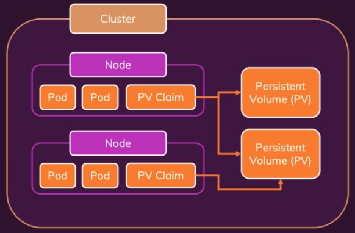

## From Volumes to Persistent Volumes

### 1. Persistent Volume

* emptyDir 사용 시 제한사항
    * Volumes are destoryed when a Pod is removed
    * Pods가 스케일링 되면 각자 다른 볼륨을 사용하게 된다.
* hostPath 사용 시 제한사항
    * emptyDir의 볼륨이 Pod에 종속된 문제점을 해결하기 위해 사용한다.
    * works around that in One-Node environments
    * Multiple Node에서는 사용 불가능
* Pod and Node 에 독립적인 볼륨이 필요하며, Persistent Volume에 대한 컨셉이 있다.
    * 클러스터 내부에 Persistent Volume이 존재한다.
    * Node에서 PV Claim을 이용하여 PV에 접근한다.
    * PV Claim은 Pod, Node와 독립적으로 동작한다.
    * PV Claim은 여러 개의 PV에 접근 가능하다.
    * PV는 Node 안에 존재하는게 아니라 클러스터 내부 어딘가 존재한다.
        * Cloud Storage 등을 사용한다.

